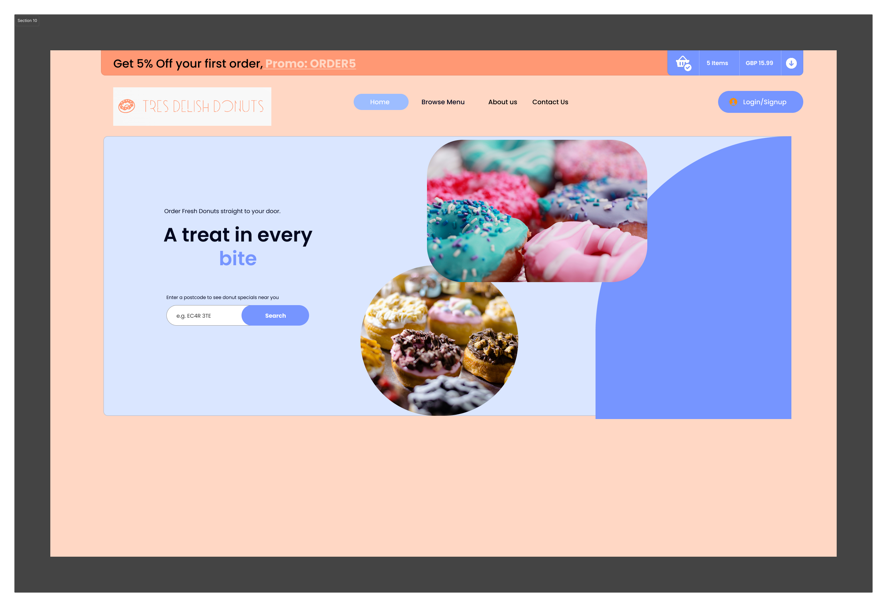
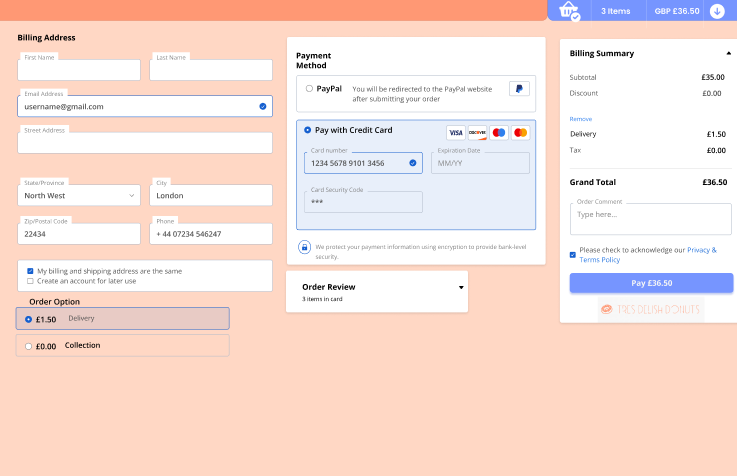
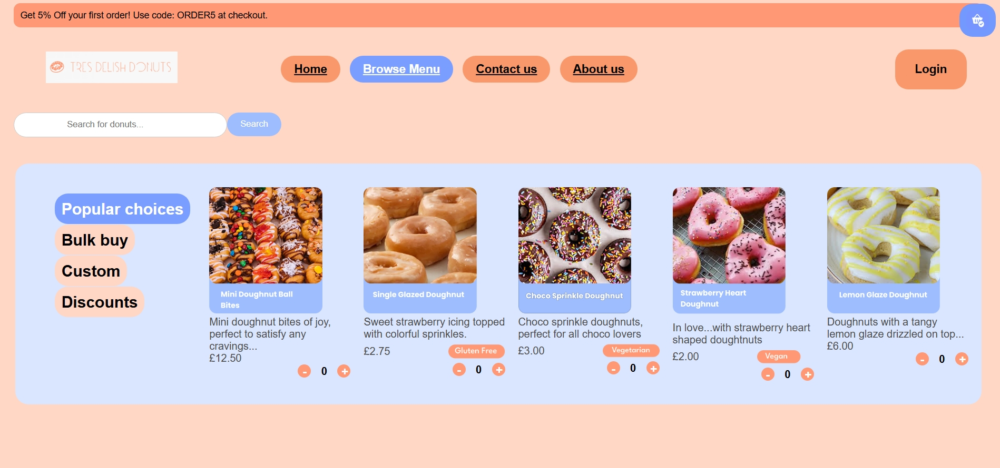
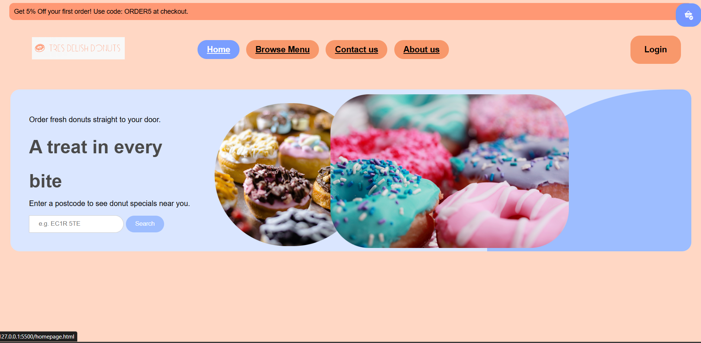
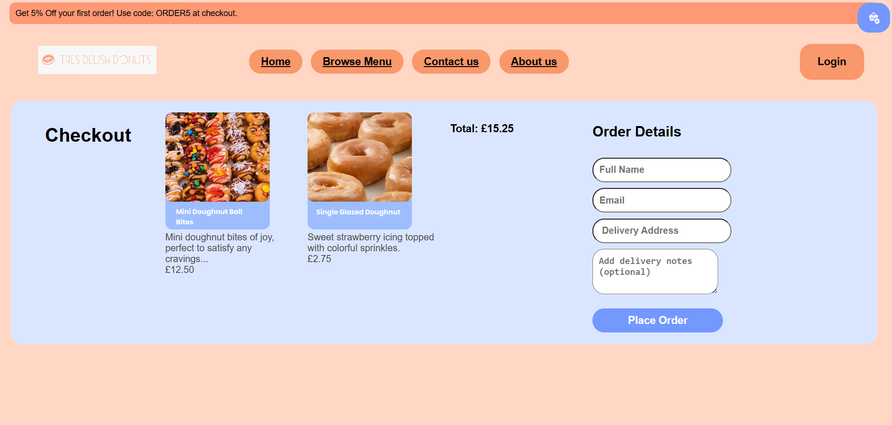

# Duluxe-code
## What the project does?
This project uses html, css and java to create a donut ordering website. 
Most donut ordering websites are flashy and covered in ads rather than letting the user decide for themselves. This website design allows users to search for a donut that matches their needs.

The menu isn't fully functioning yet but you can see the main functions of it. 

Donuts can be ordered as a guest or with a login to view previous orders (feature not added yet). 

As a user of the website any questions, comments or feeback can be submitted using the contact form. 

## What value does it provide to its users?
User persona 1 - Simon Denzel
Simon Denzel is 35 and has been working in an office
and is known to order the best treats for office events.
He isn't afraid to spend a little extra time researching for
quality. He knows what a good website looks like and
can be quite critical of them so expects a clean,
professional shopping experience with no pop-ups.

Features added for Simon: Bulk buy option on the menu. Can order large boxes at a discount. 
Descriptions for each menu item.
Mininal ads.
Discount section to avoid pop-ups.

Maintenance: When selecting an item, the item will have a page of its own. When you scroll down on that page it will have reviews for the item selected. 

User persona 2 - Zainab Hassan

Zainab Hassan is a 21-year-old university student
studying Psychology, who tends to get overwhelmed
with all her assignment work and loves to treat
herself to a sweet treat.
Zainab loves to post on Instagram, so prioritizes the
visual appearance of what she orders. She loves a
website that looks visually appealing and fun with bright
colours and interesting website features.

Features added for Zainab:
The website has a fun colour palette with a modern design.

Kept the distractions on the website to a low since she is probably in a rush to order. 

Discounts in a seperate tab so she can quickly find things + search bar. 

Each menu item has an image as a preview to what it looks like. 

Maintenance: Have customer guarantees that the doughnut will not come with smudged icing. 

Email subscription for future offers. 

Student discounts on weekends. 

## Revised wireframes 

## Finished product screenshots
 

